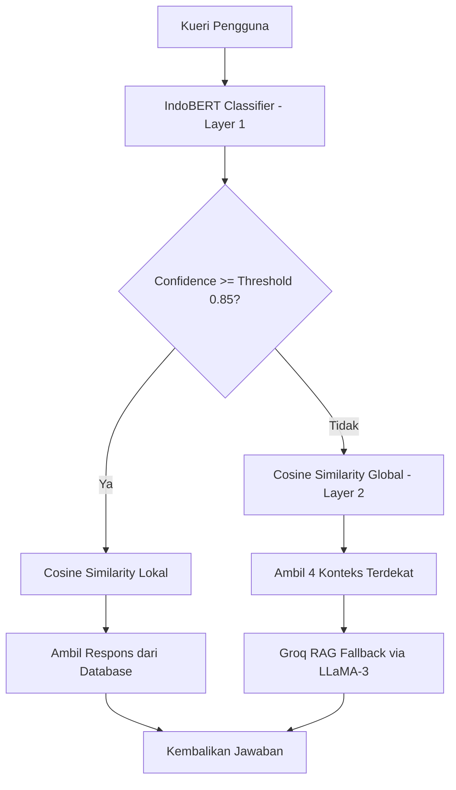

# DiaBites Chatbot API - Hybrid Chatbot Diabetes & Gizi

DiaBites Chatbot API adalah asisten virtual pintar berbasis kecerdasan buatan (AI) yang dirancang untuk memberikan edukasi seputar penyakit diabetes, pola makan sehat, gizi, dan gaya hidup sehat di Indonesia. Chatbot ini dibangun dengan pendekatan _Hybrid_ yang menggabungkan klasifikasi intent berbasis Deep Learning (NLP) dan pencarian kesamaan semantik (_semantic search_) lokal/global dengan model generatif Large Language Model (LLM) sebagai sistem cadangan (_generative fallback_).

Deployment HuggingFace: https://huggingface.co/spaces/fzikri169/diabites-chatbot-indonesia?logs=container
---

## Deskripsi Singkat Proyek & Arsitektur

Sistem ini menerapkan **Dual-Layer Pipeline** untuk memproses kueri pengguna secara optimal:



1. **Layer 1: Klasifikasi Intent & Cosine Similarity Lokal**
   - Kueri pengguna diproses menggunakan model **IndoBERT** (`indobenchmark/indobert-base-p2`) untuk memprediksi intent (tag) pertanyaan dengan output tingkat kepercayaan (_confidence score_).
   - Jika _confidence score_ $\ge$ **Threshold** (default: `0.85`):
     - Sistem melakukan pencarian **Cosine Similarity Lokal** antara embedding kueri pengguna dengan embedding pola pertanyaan (_patterns_) yang terasosiasi dengan intent tersebut di database.
     - Respons yang paling relevan secara semantis akan dikembalikan kepada pengguna.
2. **Layer 2: Cosine Similarity Global & Generative Fallback (RAG)**
   - Jika _confidence score_ < **Threshold** (kueri bersifat umum, typo parah, atau tidak masuk klasifikasi):
     - Sistem melakukan pencarian **Cosine Similarity Global** di seluruh dataset untuk mengekstrak 4 pasang pola dan respons paling relevan secara semantik sebagai konteks.
     - Konteks ini disuntikkan ke dalam sistem **Retrieval-Augmented Generation (RAG)** menggunakan model LLM **LLaMA-3.1-8b-instant**.
     - Model generatif akan menyusun jawaban yang santun, akurat, dan medis-aman berdasarkan informasi relevan dari database DiaBites.

---

## Petunjuk Setup Environment

Ikuti langkah-langkah di bawah ini untuk menyiapkan lingkungan kerja di komputer lokal Anda:

### 1. Prasyarat (Prerequisites)

Pastikan komputer Anda sudah terpasang:

- **Python 3.8 - 3.11** (Direkomendasikan Python 3.10)
- Koneksi internet aktif (untuk mengunduh model IndoBERT saat inisialisasi pertama kali)

### 2. Klon Repositori

```bash
git clone https://github.com/FarelZIKRI/Diabites-OCR-CRNN-.git
cd CHATBOT
```

### 3. Buat dan Aktifkan Virtual Environment

- **Windows (Command Prompt / PowerShell)**:
  ```powershell
  python -m venv venv
  .\venv\Scripts\activate
  ```
- **macOS / Linux**:
  ```bash
  python3 -m venv venv
  source venv/bin/activate
  ```

### 4. Instal Dependensi

Pasang semua pustaka (library) yang dibutuhkan dengan perintah berikut:

```bash
pip install -r requirements.txt
```

### 5. Konfigurasi Environment Variables (`.env`)

Salin berkas `.env.example` menjadi berkas baru bernama `.env`:

```bash
cp .env.example .env
```

Buka file `.env` tersebut dan sesuaikan konfigurasinya:

```ini
# Groq API Key untuk Generative Fallback
GROQ_API_KEY=your_groq_api_key_here

# Model Groq yang digunakan
GROQ_MODEL=your_generative_model

# Batas minimum klasifikasi
CONFIDENCE_THRESHOLD=your_treshold

# Konfigurasi Host dan Port Server API FastAPI
HOST=your_host_configuration
PORT=your_port_configuration
```

> **Penting**: Jika API Key tidak dikonfigurasi, sistem RAG Layer 2 tidak akan aktif dan akan menggunakan pesan kegagalan (_fallback error_).

---

## Model ML (Machine Learning Model)

Proyek ini menggunakan dua bagian model Machine Learning:

1. **Base Embedding Model**: Menggunakan model encoder **IndoBERT** (`indobenchmark/indobert-base-p2`) yang otomatis diunduh dari Hugging Face Hub saat aplikasi dijalankan pertama kali.
2. **Intent Classification Head**:
   - Repositori ini **telah menyertakan** berkas weights pra-latih: `model/saved_model/indobert_chatbot_weights.h5` (2.1 MB).
   - API secara dinamis memuat arsitektur model klasifikasi dan mengaitkan weights tersebut saat _startup_, sehingga Anda tidak perlu melakukan pelatihan ulang (training) untuk menjalankan aplikasi.
   - Model penuh `model/saved_model/indobert_chatbot.keras` berukuran sekitar 500 MB tidak dimasukkan ke dalam Git (`.gitignore`) karena batas ukuran berkas.
3. **Metrik Performa Model**:
   Model klasifikasi ini telah memenuhi kriteria kelulusan metrik dengan hasil evaluasi pada data validasi:
   - **Validation Accuracy**: `99.2366%` (Kriteria: $\ge$ 85%)
   - **Validation MAE**: `0.001649` (Kriteria: $\le$ 0.02)

---

## Cara Menjalankan Aplikasi

Aplikasi ini menyediakan beberapa mode untuk dijalankan:

### A. Melatih Model Klasifikasi (Opsional)

Jika Anda melakukan modifikasi pada dataset atau ingin melatih ulang klasifikasi head model:

```bash
python model/train.py
```

_Proses ini sangat cepat (hanya beberapa detik) karena model menggunakan pre-computed embeddings yang telah dihitung sebelumnya._

### B. Menjalankan Mode Interaktif CLI (Testing Cepat)

Anda dapat melakukan interaksi langsung dengan model asisten chatbot melalui antarmuka konsol/terminal:

```bash
python inference/predict.py
```

Ketik pertanyaan Anda di terminal, lalu tekan **Enter**. Ketik `quit` untuk keluar.

### C. Menjalankan API Server Produksi (FastAPI)

Untuk menjalankan web API yang dapat dikoneksikan ke antarmuka aplikasi Android, Web, atau Frontend lainnya:

```bash
python api/main.py
```

Server FastAPI akan berjalan di `http://127.0.0.1:8000`.

---

## API Specification & Penggunaan

### 1. Health Check

- **Endpoint**: `GET /`
- **Deskripsi**: Verifikasi status server dan konfigurasi model yang aktif.
- **Response Contoh**:
  ```json
  {
    "status": "healthy",
    "app": "DiaBites Chatbot API",
    "confidence_threshold": 0.85,
    "model": "IndoBERT + Cosine Similarity Hybrid",
    "fallback_model": "llama-3.1-8b-instant"
  }
  ```

### 2. Chat Endpoint

- **Endpoint**: `POST /chat`
- **Body Request (JSON)**:
  ```json
  {
    "message": "Bagaimana cara mencegah diabetes melitus?"
  }
  ```
- **Response Contoh (Layer 1 - Klasifikasi Lokal)**:
  ```json
  {
    "response": "Pencegahan diabetes melitus dapat dilakukan dengan menjaga berat badan ideal, rutin berolahraga minimal 150 menit per minggu, membatasi konsumsi gula dan karbohidrat olahan, serta memperbanyak makan serat.",
    "intent": "pencegahan_diabetes",
    "confidence": 0.9824,
    "source": "classification_local"
  }
  ```
- **Response Contoh (Layer 2 - Generative Fallback RAG)**:
  ```json
  {
    "response": "Berdasarkan informasi yang tersedia, untuk penderita diabetes disarankan membatasi konsumsi nasi putih dan menggantinya dengan karbohidrat kompleks seperti beras merah atau gandum. Selain itu, Anda sebaiknya membatasi makanan tinggi gula, mentega berlebih, serta makanan cepat saji.",
    "intent": "nutrisi_umum",
    "confidence": 0.3412,
    "source": "generative_fallback"
  }
  ```
